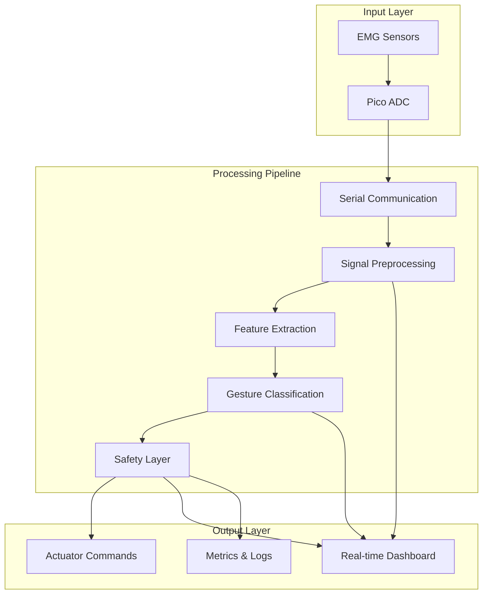
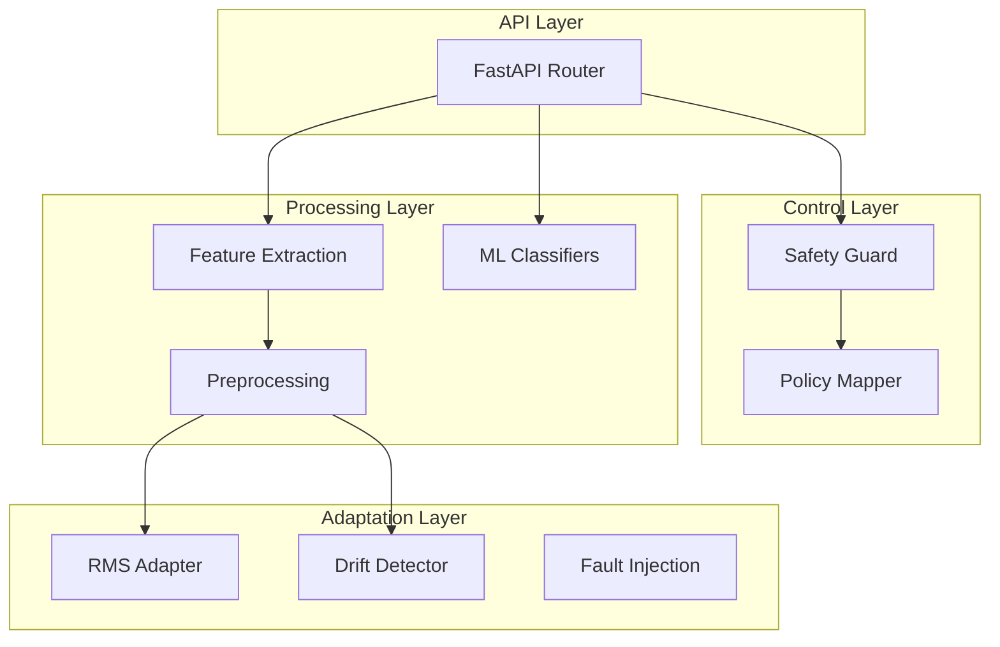

# Motion AI: EMG Gesture Recognition System - Complete Documentation

## Table of Contents

1. [Project Overview](#project-overview)
2. [System Architecture](#system-architecture)
3. [Core Components](#core-components)
4. [API Endpoints](#api-endpoints)
5. [Machine Learning Models](#machine-learning-models)
6. [Data Models & Schemas](#data-models--schemas)
7. [Signal Processing Pipeline](#signal-processing-pipeline)
8. [Safety System](#safety-system)
9. [Demo Applications](#demo-applications)
10. [Installation & Setup](#installation--setup)
11. [Usage Examples](#usage-examples)
12. [Development Guide](#development-guide)

---

## Project Overview

### Introduction
Motion AI is a comprehensive machine learning framework designed to interpret hand gestures from electromyography (EMG) signals. The system processes raw EMG data through a multi-stage pipeline that includes signal preprocessing, feature extraction, gesture classification, safety validation, and actuator command generation.

### Key Features
- **Real-time EMG Processing**: Multi-channel EMG signal processing with low latency
- **Adaptive Thresholding**: Automatic adjustment to changing baseline signals
- **Drift Detection**: Identification of significant signal characteristic changes
- **Fault Resilience**: Robust handling of noise, dropouts, and signal degradation
- **Safety Layer**: Comprehensive safety mechanisms with deadzone, hysteresis, and rate limiting
- **Metrics Tracking**: Monitoring of accuracy, latency, and safety interventions
- **Interactive Dashboard**: Real-time visualization of EMG signals and gesture predictions

### Target Applications
- Prosthetic device control
- Human-computer interaction
- Gesture-based device control
- Biomedical research
- Accessibility technology

---

## System Architecture

### High-Level Architecture


### Component Architecture


---

## Core Components

### 1. API Router (`motion_ai/api/router.py`)
**Purpose**: Central FastAPI-based API interface for the system
**Key Endpoints**:
- `/health` - Health check
- `/v1/classify` - Gesture classification
- `/v1/policy` - Policy mapping
- `/v1/hybrid` - End-to-end processing

### 2. Safety Layer (`motion_ai/control/safety_layer.py`)
**Purpose**: Ensures safe operation through multiple safety mechanisms
**Features**:
- Rate limiting
- Dead zone filtering
- Hysteresis prevention
- Command validation
- Haptic feedback alerts

### 3. Feature Extractors (`motion_ai/features/extractors.py`)
**Purpose**: Extract meaningful features from EMG signals
**Supported Features**:
- RMS (Root Mean Square)
- MAV (Mean Absolute Value)
- Frequency domain features
- Statistical features

### 4. Preprocessing (`motion_ai/preprocess/`)
**Components**:
- `filters.py` - Signal filtering and noise reduction
- `adaptation.py` - Adaptive baseline adjustment and drift detection
- `faults.py` - Fault injection for resilience testing

### 5. Classifiers (`motion_ai/classifiers/`)
**Available Models**:
- `mlp_light.py` - Multi-layer Perceptron classifier
- `svm_baseline.py` - Support Vector Machine baseline

---

## API Endpoints

### Health Check
```http
GET /health
```
**Response**:
```json
{
  "status": "ok"
}
```

### Gesture Classification
```http
POST /v1/classify
```
**Request Body**:
```json
{
  "timestamp": 1732310400.0,
  "channels": [0.1, 0.2, 0.3],
  "metadata": {
    "include_design_candidates": true,
    "model_id": "deep_learning_emg_model.h5"
  }
}
```
**Response**:
```json
{
  "gesture": "open_hand",
  "confidence": 0.85,
  "features": {
    "channels_len": 3,
    "timestamp": 1732310400.0,
    "rms": [0.15, 0.12, 0.18]
  },
  "design_candidates": []
}
```

### Policy Generation
```http
POST /v1/policy
```
**Request Body**:
```json
{
  "gesture": "pinch",
  "confidence": 0.8,
  "features": {
    "channels_len": 3,
    "timestamp": 1732310400.0
  }
}
```
**Response**:
```json
[
  {
    "actuator_id": "thumb",
    "angle": 30.0,
    "force": null,
    "safety_flags": {
      "deadzone_applied": false,
      "hysteresis_applied": false,
      "rate_clamped": false
    },
    "is_safe": true,
    "rate_clamped": false,
    "haptic_alert": null
  }
]
```

### Hybrid Processing
```http
POST /v1/hybrid
```
Combines classification and policy generation in a single endpoint with full safety processing.

---

## Machine Learning Models

### 1. Multi-Layer Perceptron (MLP)
**File**: `motion_ai/classifiers/mlp_light.py`
**Architecture**:
- Single hidden layer
- Configurable number of neurons
- ReLU activation
- Softmax output for multi-class classification

**Training**:
```python
from motion_ai.classifiers.mlp_light import train_mlp

model_bundle = train_mlp(
    csv_path="data/emg_data.csv",
    window_ms=200,
    hop_ms=100,
    fs=1000.0,
    n_features=20,
    hidden_size=100
)
```

### 2. Support Vector Machine (SVM)
**File**: `motion_ai/classifiers/svm_baseline.py`
**Configuration**:
- RBF kernel
- Cross-validation for hyperparameter tuning
- Feature scaling included

### 3. Deep Learning Models
**Supported Formats**:
- TensorFlow/Keras `.h5` files
- Preprocessing bundles (`.pkl`)
- Custom architectures via training scripts

### Training Scripts
Located in `test_files/` directory:
- `train_ar_random_forest.py` - Autoregressive Random Forest
- `train_deep_learning_model.py` - Deep neural networks
- `train_optimized_emg_model.py` - Optimized models
- Multiple specialized training scripts for different model types

---

## Data Models & Schemas

### SignalFrame
```python
class SignalFrame(BaseModel):
    timestamp: float  # Unix epoch seconds
    channels: List[float]  # EMG readings in fixed channel order
    metadata: Dict[str, Any]  # Configuration and context
```

### IntentFrame
```python
class IntentFrame(BaseModel):
    gesture: str  # e.g., "open_hand", "pinch", "rest"
    confidence: float  # [0.0, 1.0]
    features: Dict[str, Any]  # Extracted features
    soft_priority: float  # Priority level [0.0, 1.0]
    design_candidates: Optional[List[Dict]]  # UI visualization
```

### MotorCmd
```python
class MotorCmd(BaseModel):
    actuator_id: str  # Unique actuator identifier
    angle: Optional[float]  # Target angle in degrees
    force: Optional[float]  # Target force in Newtons
    safety_flags: Dict[str, Any]  # Safety annotations
    is_safe: bool  # Overall safety assessment
    rate_clamped: bool  # Rate limiting applied
    haptic_alert: Optional[str]  # Haptic feedback reason
```

---

## Signal Processing Pipeline

### 1. Data Acquisition
- Multi-channel EMG signal capture
- Configurable sampling rates (typically 1000 Hz)
- Real-time streaming or batch processing

### 2. Preprocessing
- **Bandpass Filtering**: Remove noise and artifacts
- **Normalization**: Adaptive baseline adjustment
- **Windowing**: Overlapping time windows for analysis

### 3. Feature Extraction
```python
# Time-domain features
rms = sqrt(mean(signal^2))
mav = mean(abs(signal))

# Frequency-domain features
fft_features = fft(windowed_signal)
power_spectral_density = |fft_features|^2

# Statistical features
variance = var(signal)
skewness = skew(signal)
kurtosis = kurt(signal)
```

### 4. Classification
- Feature vector input to trained ML model
- Confidence-based thresholding
- Multi-class gesture recognition

### 5. Safety Processing
- Command validation and filtering
- Rate limiting and deadzone application
- Hysteresis prevention

---

## Safety System

### Safety Configuration
```python
class SafetyConfig:
    max_angle_rate_deg_s: float = 90.0  # Maximum angular velocity
    dead_zone_angle_deg: float = 1.5    # Minimum significant movement
    dead_zone_force: float = 0.2        # Minimum significant force
    hysteresis_high_deg: float = 2.0    # Upper hysteresis threshold
    hysteresis_low_deg: float = 1.0     # Lower hysteresis threshold
    max_angle_abs_deg: float = 90.0     # Maximum absolute angle
    max_force_abs: float = 5.0          # Maximum absolute force
```

### Safety Mechanisms

1. **Dead Zone Filtering**
   - Filters out small, unintentional movements
   - Prevents actuator jitter

2. **Rate Limiting**
   - Limits maximum speed of actuator movement
   - Prevents dangerous rapid movements

3. **Hysteresis**
   - Prevents rapid oscillation between states
   - Provides stability in boundary conditions

4. **Confidence Thresholding**
   - Rejects low-confidence predictions
   - Defaults to safe "rest" state

5. **Drift Detection**
   - Monitors signal baseline changes
   - Triggers adaptation or alerts

---

## Demo Applications

### 1. Command-Line Demo (`demo/run_motion_ai.py`)
**Purpose**: Comprehensive demonstration of the full pipeline
**Features**:
- CSV data processing
- Model loading and inference
- Metrics generation
- Visualization
- Fault injection testing

**Usage**:
```bash
python demo/run_motion_ai.py --csv demo/sample.csv --live_plot
```

### 2. Integrated Demo (`demo/final_integrated_demo.py`)
**Purpose**: Real-time interactive demonstration
**Features**:
- Simulated EMG sensor data
- Real-time dashboard
- Multiple user profiles
- Haptic feedback simulation
- Safety event monitoring

**Usage**:
```bash
python demo/final_integrated_demo.py
```

---

## Installation & Setup

### Prerequisites
- Python 3.8+
- pip package manager
- Git

### Installation Steps
```bash
# Clone repository
git clone https://github.com/creation-extro/emg_serial.git
cd emg_serial

# Create virtual environment
python -m venv venv
venv\Scripts\activate  # Windows
# source venv/bin/activate  # Linux/Mac

# Install dependencies
pip install -r requirements.txt
```

### Dependencies
```txt
numpy>=1.20.0
pandas>=1.3.0
scikit-learn>=1.0.0
tensorflow>=2.8.0
matplotlib>=3.4.0
fastapi>=0.68.0
uvicorn>=0.15.0
pydantic>=1.8.0
joblib>=1.0.0
```

---

## Usage Examples

### Basic Classification
```python
from motion_ai.api.router import router
from motion_ai.api.router import SignalFrame

# Create signal frame
signal = SignalFrame(
    timestamp=time.time(),
    channels=[0.1, 0.2, 0.3, 0.15],
    metadata={"model_path": "models/emg_model.pkl"}
)

# Classify gesture
result = await router.classify(signal)
print(f"Gesture: {result.gesture}, Confidence: {result.confidence}")
```

### Running API Server
```bash
uvicorn motion_ai.api.router:app --reload --host 0.0.0.0 --port 8000
```

### Model Training
```python
from motion_ai.classifiers.mlp_light import train_mlp

# Train new model
model = train_mlp(
    csv_path="data/training_data.csv",
    window_ms=200,
    hop_ms=100,
    test_size=0.2
)

# Save model
joblib.dump(model, "models/new_model.pkl")
```

### Safety Configuration
```python
from motion_ai.control.safety_layer import SafetyGuard, SafetyConfig

# Configure safety parameters
config = SafetyConfig(
    max_angle_rate_deg_s=45.0,  # Slower movement
    dead_zone_angle_deg=2.0,    # Larger dead zone
    confidence_threshold=0.8    # Higher confidence required
)

safety_guard = SafetyGuard(config)
```

---

## Development Guide

### Project Structure
```
motion_ai/
├── api/                 # FastAPI router and endpoints
│   ├── __init__.py
│   └── router.py
├── classifiers/         # ML models
│   ├── __init__.py
│   ├── mlp_light.py
│   └── svm_baseline.py
├── control/             # Safety and control logic
│   ├── __init__.py
│   └── safety_layer.py
├── eval/                # Evaluation utilities
│   ├── __init__.py
│   └── offline_eval.py
├── features/            # Feature extraction
│   ├── __init__.py
│   └── extractors.py
├── preprocess/          # Signal preprocessing
│   ├── __init__.py
│   ├── adaptation.py
│   ├── faults.py
│   └── filters.py
├── CONTRACT.md          # API contracts
└── __init__.py
```

### Adding New Models
1. Create new classifier in `motion_ai/classifiers/`
2. Implement standard interface:
   ```python
   def train_model(csv_path, **kwargs):
       # Training logic
       return model_bundle
   
   def predict(model_bundle, features):
       # Prediction logic
       return gesture, confidence
   ```

### Adding New Features
1. Add feature extraction function to `motion_ai/features/extractors.py`
2. Update feature extraction pipeline
3. Retrain models with new features

### Testing
```bash
# Run all tests
python -m pytest test_files/

# Run specific test
python test_files/test_emg_samples.py
```

### Code Standards
- Follow PEP8 coding standards
- Include docstrings for all public functions
- Add type hints where appropriate
- Write unit tests for new functionality

---

## Metrics and Monitoring

### Generated Metrics
- **Classification Accuracy**: Percentage of correct predictions
- **Latency Statistics**: Mean, median, P95, and maximum processing time
- **Safety Events**: Count of safety interventions by type
- **Adaptation Events**: Baseline updates and drift detection

### Metrics Card Example
```markdown
# Motion AI Metrics Card

## Classification Performance
- Accuracy: 87.3%
- Total Windows: 1,247
- Confidence Threshold: 0.6

## Latency Performance
- Mean: 12.3ms
- Median: 11.8ms
- P95: 18.2ms
- Maximum: 34.1ms

## Safety Events
- Deadzone Applied: 23
- Hysteresis Applied: 8
- Rate Clamped: 5
- Haptic Alerts: 12

## Adaptation Events
- Baseline Updates: 3
- Drift Detected: 1
```

---

This documentation provides a comprehensive overview of the Motion AI EMG Gesture Recognition System, covering all major components, APIs, models, and usage patterns implemented in the project.